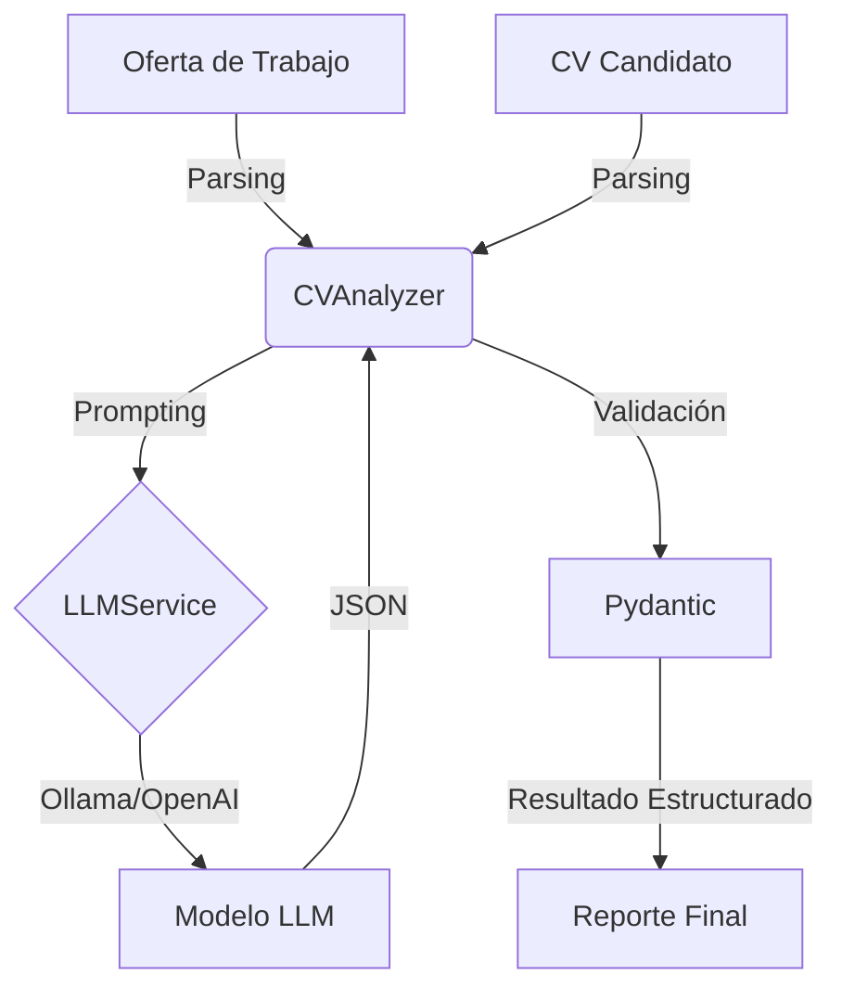

# Guía de Defensa Técnica - CV Evaluator

Esta guía técnica detallada está diseñada para ayudarte a defender el proyecto `CV Evaluator` en una entrevista. Profundiza en la arquitectura, patrones de diseño y decisiones críticas, **incluyendo ejemplos de código reales del proyecto** para que puedas señalarlos y explicarlos con propiedad.

---

## 1. Arquitectura y Stack Tecnológico

**Objetivo:** Automatizar la evaluación de candidatos (Text Parsing + Semantic Matching) usando LLMs.

### Diagrama de Flujo de Datos


### Por qué Python 3.x
Elegido por ser el estándar de facto en Inteligencia Artificial. Librerías como `LangChain` y `Pydantic` tienen soporte nativo de primera clase.

---

## 2. Análisis Profundo de Componentes

### A. Capa de Abstracción de LLM (`LLMService`)
**Ubicación:** `src/services/llm_service.py`

**Concepto Clave:** Evitar el "Vendor Lock-in" (dependencia de un solo proveedor como OpenAI).
**Patrón:** Factory Pattern (implícito).

**Defensa Técnica:**
"He implementado un servicio agnóstico al proveedor. El método `_create_llm` actúa como una factoría que instancia la clase correcta de LangChain basándose en la configuración. Esto permite cambiar de un modelo local (Llama3) a uno de nube (GPT-4) solo cambiando el archivo `.env`, sin tocar una sola línea de lógica de negocio."

**Código Relevante:**
```python
# src/services/llm_service.py

class LLMService:
    def _create_llm(self) -> BaseLanguageModel:
        """Factory method para crear el cliente LLM correcto."""
        if self.provider == LLMProvider.OLLAMA:
            # Uso local y privado, coste cero
            from langchain_ollama import OllamaLLM
            return OllamaLLM(model=self.model, base_url=settings.ollama_base_url)

        elif self.provider == LLMProvider.OPENAI:
            # Mayor calidad, pago por token
            from langchain_openai import ChatOpenAI
            return ChatOpenAI(api_key=settings.openai_api_key)
            
        # ... Fácilmente extensible para Azure, Gemini, Anthropic...
```

### B. Validación Estricta de Datos (`Pydantic`)
**Ubicación:** `src/models/schemas.py`

**Concepto Clave:** Type Safety y Parsing de Salidas de LLM. Los LLMs son probabilísticos y a veces fallan al generar JSON. Pydantic fuerza la estructura.

**Defensa Técnica:**
"No confío ciegamente en la salida del LLM. Uso modelos de Pydantic para definir el esquema esperado. Si el LLM alucina un campo o pone un string donde va un entero, Pydantic lanza un error de validación que puedo capturar y manejar, o reintentar."

**Código Relevante:**
```python
# src/models/schemas.py

class RequirementType(str, Enum):
    MANDATORY = "mandatory"  # Crítico: si falla, descarta
    OPTIONAL = "optional"    # Sube score, pero no descarta

class CVEvaluationResult(BaseModel):
    score: int = Field(..., ge=0, le=100)  # El score DEBE ser 0-100
    discarded: bool
    # Listas tipadas aseguran que no recibimos nulos o tipos incorrectos
    matching_requirements: List[str] 
    unmatching_requirements: List[str]
```

### C. Ingeniería de Prompts (`Templates`)
**Ubicación:** `src/prompts/templates.py`

**Concepto Clave:** Separation of Concerns (Separación de Preocupaciones). Los prompts son "código" en aplicaciones de IA, y deben estar versionados y separados de la lógica Python.

**Defensa Técnica:**
"He separado los prompts en un archivo de templates. Uso técnicas como 'Few-Shot Prompting' (dando ejemplos) y 'Chain of Thought' (pidiendo razonamiento) para mejorar la precisión. Instruyo explícitamente al modelo para que devuelva JSON puro para facilitar el parsing."

**Código Relevante:**
```python
# src/prompts/templates.py

EVALUATE_CV_PROMPT = """
...
INSTRUCCIONES:
1. Para cada requisito, determina si el CV lo cumple...
4. Criterios de evaluación (SIGUE ESTE ORDEN):
   PASO 1: Busca PALABRAS CLAVE NEGATIVAS...
   PASO 2: Busca EVIDENCIA POSITIVA...
   
Responde ÚNICAMENTE con un JSON válido con esta estructura exacta:
{{
    "evaluations": [...]
}}
"""
```

---

## 3. Preguntas de Entrevista "Hardcore" (Y sus Respuestas)

### P: "¿Cómo manejas situaciones donde el LLM responde texto basura antes del JSON?"
**R:** "Es un problema común. En mi `LLMService`, implementé un método `_parse_json_response` que usa Expresiones Regulares (Regex) como mecanismo de recuperación (fallback). Si el parser estándar de JSON falla, el regex busca el bloque delimitado por `{...}` o ```json ... ``` dentro de la respuesta para extraer la carga útil válida."

```python
# snippet de _parse_json_response
json_patterns = [
    r"```json\s*([\s\S]*?)\s*```", # Bloques de código markdown
    r"\{[\s\S]*\}",               # Objeto JSON crudo
]
```

### P: "¿Por qué no usar simplemente `if 'python' in cv_text`?"
**R:** "Porque el 'keyword matching' es frágil.
1. **Falsos Positivos:** El candidato podría decir 'Me gustaría aprender Python' (no lo sabe) o 'No tengo experiencia en Python'. Un `if` simple fallaría.
2. **Contexto Semántico:** El LLM entiende que 'Django' implica 'Python', o que 'AWS' y 'Amazon Web Services' son lo mismo. Mi evaluador semántico captura estos matices que un script de búsqueda de texto perdería."

### P: "¿Es este sistema escalable para procesar 1000 CVs?"
**R:** "En su forma actual CLI secuencial, no. Para escalarlo:
1. Pasaría a arquitectura asíncrona (AsyncIO) en Python.
2. Usaría una cola de mensajes (RabbitMQ/Redis) para desacoplar la recepción del CV de su procesamiento.
3. Lanzaría workers paralelos que consuman de esa cola, ya que la limitante principal es la latencia de I/O del LLM, no la CPU."

---

## 4. Guía de Modificación en Vivo

Si en la entrevista te dicen: *"Añade un campo 'Soft Skills' al análisis"*:

1.  **Modificar Modelo:**
    Ve a `src/models/schemas.py`, clase `CVEvaluationResult`:
    ```python
    soft_skills: List[str] = Field(default_factory=list, description="Habilidades blandas detectadas")
    ```

2.  **Modificar Prompt:**
    Ve a `src/prompts/templates.py`, `EVALUATE_CV_PROMPT`:
    Añade instrucción: *"Extrae también habilidades blandas (liderazgo, comunicación) en una lista separada."*
    Actualiza el JSON de salida esperado en el prompt.

3.  **Listo:** Pydantic y LangChain harán el resto automáticamente.
